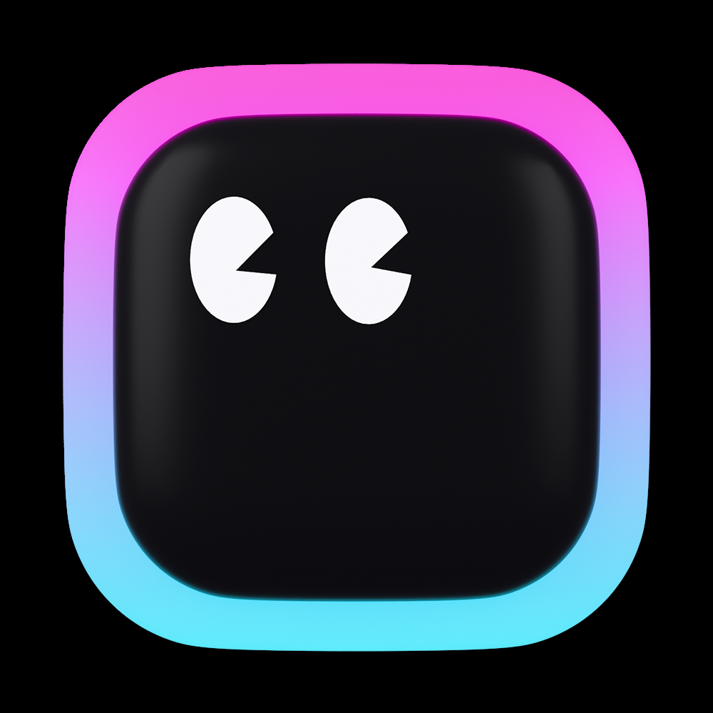
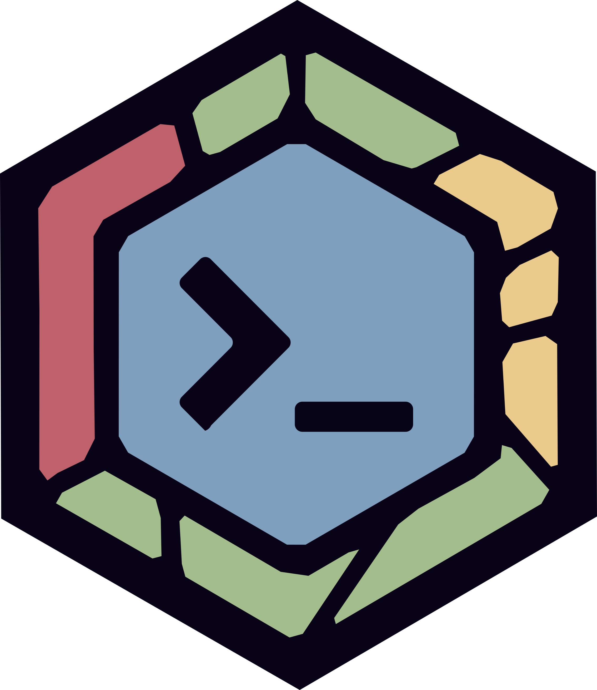

<h1 align="center">
  
</h1>

 

  
  
   
  <code><a href="hengvvang@gmail.com" title="Gmail Profile"> Gmail</a></code>
  <code><a href="hengvvang@proton.me" title="Protonmail Profile"> Protonmail</a></code>
</h5>

  
  

  

  <code></code>
  <code></code>
  <code></code>
  <code></code>
  <code></code>
  <code></code>
  

   

  

  <code></code>
  <code></code>
  <code></code>
  

   

<h2 align="center">⚡ Stats ⚡</h2>

  

  
  

